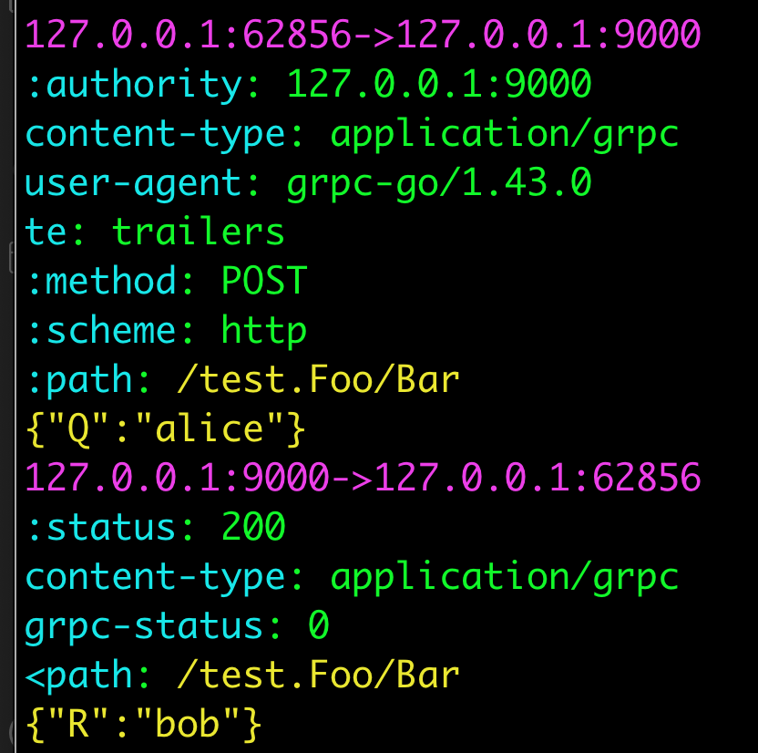

# grpcdump
A tcpdump like tool for auto decode protobuf in grpc h2c protocol

## feature
- [x] h2c capture & decode
- [x] grpc protbuf auto decode use [Reflection](https://github.com/grpc/grpc/blob/master/doc/server-reflection.md) service
- [x] specify proto file manually if reflection not register
- [ ] simple BPF compiler for pure go build (linux only)

## preview

## usage
this tool has one require param, `-i`, choose ur interface same as *tcpdump*.

but u should use [pcap-filter](https://www.tcpdump.org/manpages/pcap-filter.7.html) to reduce memory in production environment (also same as *tcpdump*).

**not decode on-the-fly tcp stream defaultly** (tcp has been connected before capture, cuz of HPACK)

| parameter | short | description |
|-|-|-|
|interface|i|same as tcpdump
|snapshot-length|s|same as tcpdump
|path-regex|P|focus to show
|force||enable on-the-fly(use with pcap-filter)
|hide-no-path||non-path packet can't decode
|proto-include|I|use like protoc -I
|proto-file|f|proto relative path about proto-include

### some case
use with my test cmd

1. `grpcdump -i any -P "/test\.Foo/Bar" "host 127.0.0.1 and port 9000"`
2. `grpcdump -i lo0 -P "/test\.Foo/Bar" -I .. -f grpcdump/test/pb/foo.proto "host 127.0.0.1 and port 9000"`

## require
1. **mac/win**: install [Wireshark](https://www.wireshark.org/download.html)
    or only install *ChmodBPF.pkg*
2. **linux**: need *libpcap-dev*
